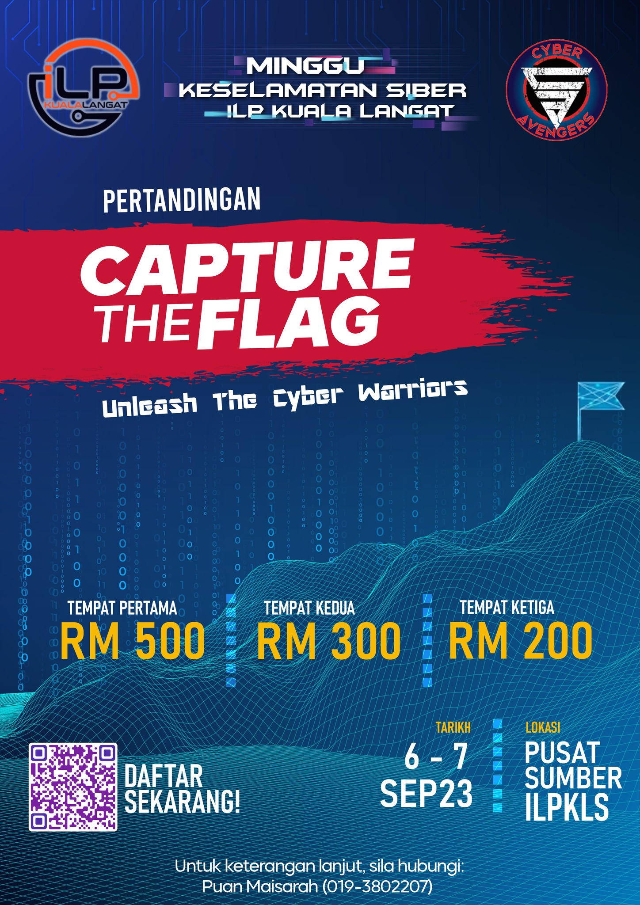

<h1> WRITE UP CTF ILP </h1>

Pertandingan <b>"CAPTURE THE FLAG" Unleash The Cyber Warrior</b>.

Diadakan di Institut Latihan Perindustrian Kuala Langat sempena program MINGGU KESELAMATAN SIBER ILP KUALA LANGAT.

+ <b><a href="#GENERAL"><strong>GENERAL</strong></a></b>
    - <a href="#Salamu">Salamu, Dunia</a>
    - <a href="#Gold">Gold Digger</a>
    - <a href="#Manage">Flag Management System</a>
    - <a href="#Admin">Be The Admin</a>
    - <a href="#Mystification">Mystification</a>
    - <a href="#Slow">Slow Internet</a>

+ <b><a href="#STOLEN">STOLEN</a></b>
    - <a href="#Whobad">Who is the bad guy?</a>

 + <b><a href="#HACKED">HACKED</a></b>
    - <a href="#hack1">Hacked 1</a>
    - <a href="#hack2">Hacked 2</a>
    - <a href="#hack3">Hacked 3</a>
    - <a href="#hack4">Hacked 4</a>
    - <a href="#hack5">Hacked 5</a>
    - <a href="#hack6">Hacked 6</a>
    - <a href="#hack7">Hacked 7</a>

 + <b><a href="#TRIVIA">TRIVIA</a></b>
    - <a href="#puisi">Puisi</a>
    - <a href="#hiding">Hiding</a>
    - <a href="#supper">Supper</a>
    
 + <b><a href="#GENERALS">.GENERAL</a></b>
    - <a href="#pocket">Pocket Dial</a>

# <h2 id="GENERAL"><strong>GENERAL</strong></h2>

 - 
<b>Salamu, Dunia</b>

 
 

Soalan diberi <i>link website</i>.

 
 

Bila di <i>click</i> ini adalah <i>content website</i> tersebut dan menyatakan bahawa hanya bahasa <b> Swahili </b> sahaja boleh mengekses kepada <i> content website </i> tersebut. Cuba akses dengan mengubah 
<i>cookies</i> website dengan bahasa <b>Swahili</b>. Menggunakan <i>Inspect Element - Tab Application - Cookies</i>.

 
 

 Disini kita dapat lihat data untuk cookies diberi nama <i> locale </i> dan <i>values</i> adalah <strong> 656E5F5553 </strong>. Apakah maksud <i>values</i> tersebut? Cuba <i> decrypt</i>. 

     
      

 <i> Copy value</i> tersebut dan paste di <i><a href="https://www.cachesleuth.com/multidecoder/"> Multidecoder </a></i> tekan <i> Solve </i>.

     
      

 <i> Scroll </i> kebawah dan jumpa value yang tepat iaitu  <i> en_US </i>. Bermaksud ini adalah <i>value</i> bahasa menggunakan<i> encryption</i> <b> Hexadecimal. </b>

  

 Pergi ke <i><a href="https://www.rapidtables.com/convert/number/hex-to-ascii.html"> Hexadecimal Decoder </a></i> dan <i>decode</i>, memang benar ini adalah  <i> values</i> bahasa <b>English</b>.

  

 Cari bahasa <b>Swahili</b> dalam bentuk <i> Code Language</i> dan <i> locale </i> : <b>sw_TZ </b>.

 

 Masukkan <i>value</i> <b>sw_TZ</b> dan <i>encrypt</i> kepada <b>Hexadecimal</b>. Copy <i>value</i> tersebut, <i>paste</i> di <i>value cookies</i> tekan <i>enter </i> dan <i>refresh</i>.

Dan ini adalah <b>flag</b>nya.

- 
<b>Gold Digger</b>

 

Soalan diberi <i>link website</i>.

 

Cuba dengan menggukan <i>command linux</i> iaitu <b>dig</b> dan <i>parameter <b>txt</b></i> untuk dapatkan info laman tersebut dan dapat <b>flag</b>.

- 
<b>Flag Management System</b>

 

Diberi adalah sebuah <i>folder</i>. <i>Download folder</i> tersebut.
 

 

<i>Extract folder</i> dan diberi adalah sebuah aplikasi berbentuk <i>EXE</i> dan <i> .Application</i> jadi ini adalah aplikasi <i>.NET</i>.
 

 

<i> Run </i> aplikasi tersebut. Ia memerlukan <i>username</i> dan <i>password</i>. 
 

 

 <i> Disamble .NET</i> menggunakan <b>JetBrains dotPeek</b>. Pilih <i>process</i> aplikasi.

 

 Dapat lihat <b> source code</b>.

 

 Masukkan <i>username</i> dan <i>password</i>. Flag.

