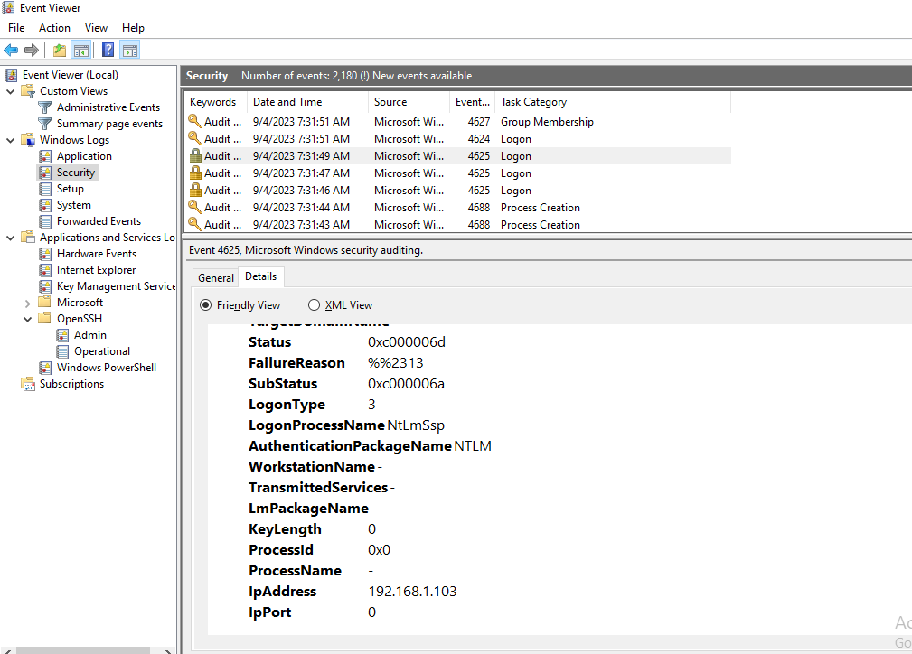

<h1> WRITE UP CTF ILP </h1>
<p>Pertandingan <b>"CAPTURE THE FLAG" Unleash The Cyber Warrior</b>.</p>
<p>Diadakan di Institut Latihan Perindustrian Kuala Langat sempena program MINGGU KESELAMATAN SIBER ILP KUALA LANGAT.</p>

<HR>

+ <b><a href="#GENERAL"><strong>GENERAL</strong></a></b>
    - <a href="#Salamu">Salamu, Dunia</a>
    - <a href="#Gold">Gold Digger</a>
    - <a href="#Manage">Flag Management System</a>
    - <a href="#Admin">Be The Admin</a>
    - <a href="#Mystification">Mystification</a>
    - <a href="#Slow">Slow Internet</a>

+ <b><a href="#STOLEN">STOLEN</a></b>
    - <a href="#Whobad">Who is the bad guy?</a>

 + <b><a href="#HACKED">HACKED</a></b>
    - <a href="#hack1">Hacked 1</a>
    - <a href="#hack2">Hacked 2</a>
    - <a href="#hack3">Hacked 3</a>
    - <a href="#hack4">Hacked 4</a>
    - <a href="#hack5">Hacked 5</a>
    - <a href="#hack6">Hacked 6</a>
    - <a href="#hack7">Hacked 7</a>

 + <b><a href="#TRIVIA">TRIVIA</a></b>
    - <a href="#puisi">Puisi</a>
    - <a href="#hiding">Hiding</a>
    - <a href="#supper">Supper</a>
    
 + <b><a href="#GENERALS">.GENERAL</a></b>
    - <a href="#pocket">Pocket Dial</a>

# <h2 id="GENERAL"><strong>GENERAL</strong></h2>

 - <h3 id="Salamu"><b>Salamu, Dunia</b></h3>
 
 
<p>Soalan diberi <i>link website</i>.</p>
 
 
<p>Bila di <i>click</i> ini adalah <i>content website</i> tersebut dan menyatakan bahawa hanya bahasa <b> Swahili </b> sahaja boleh mengakses kepada <i> content website </i> tersebut. Cuba akses dengan mengubah 
<i>cookies</i> website dengan bahasa <b>Swahili</b>. Menggunakan <i>Inspect Element - Tab Application - Cookies</i>.</p>
 
 
<p> Disini kita dapat lihat data untuk cookies diberi nama <i> locale </i> dan <i>values</i> adalah <strong> 656E5F5553</strong>. Apakah maksud <i>values</i> tersebut? Cuba <i> decrypt</i>. </p>
     
      
<p> <i> Copy value</i> tersebut dan <i>paste</i> di <i><a href="https://www.cachesleuth.com/multidecoder/"> Multidecoder </a></i> tekan <i> Solve</i>.</p>
     
      
<p> <i> Scroll </i> kebawah dan jumpa value yang tepat iaitu  <i> en_US</i>. Bermaksud ini adalah <i>value</i> bahasa menggunakan<i> encryption</i> <b> Hexadecimal. </b></p>

  
<p> Pergi ke <i><a href="https://www.rapidtables.com/convert/number/hex-to-ascii.html"> Hexadecimal Decoder </a></i> dan <i>decode</i>, memang benar ini adalah  <i> values</i> bahasa <b>English</b>.</p>

  
<p> Cari bahasa <b>Swahili</b> dalam bentuk <i> Code Language</i> dan <i> locale </i> : <b>sw_TZ </b>.</p>

 
<p> Masukkan <i>value</i> <b>sw_TZ</b> dan <i>encrypt</i> kepada <b>Hexadecimal</b>. Copy <i>value</i> tersebut, <i>paste</i> di <i>value cookies</i> tekan <i>enter </i> dan <i>refresh</i>.</p>


<p>Dan ini adalah <b>flag</b>nya.</p>

- <h3 id="Gold"><b>Gold Digger</b></h3>

 
<p>Soalan diberi <i>link website</i>.</p>

 
<p>Menggunakan <i>linux</i> iaitu <b>dig</b> dan <i>parameter <b>txt</b></i> untuk dapatkan info laman tersebut dan dapat <b>flag</b>.</p>

- <p id="Manage"><h3>Flag Management System</b></h3>

 
<p>Diberi adalah sebuah <i>folder</i>. <i>Download folder</i> tersebut.</p> 

 
<p><i>Extract folder</i> dan diberi adalah sebuah aplikasi berbentuk <i>EXE</i> dan <i> .Application</i> jadi ini adalah aplikasi <i>.NET</i>.</p> 

 
<p><i> Run </i> aplikasi tersebut. Ia memerlukan <i>username</i> dan <i>password</i>. </p> 

 
<p> <i> Disamble .NET</i> menggunakan <b>JetBrains dotPeek</b>. Pilih <i>process</i> aplikasi.</p>

 
<p> Dapat lihat <b> source code</b>.  Masukkan <i>username</i> dan <i>password</i>.</p>

 
<p> Flag.</p>

- <h3 id="Admin"><b>Be The Admin</b></h3>

 
<p>Soalan diberi <i>link website</i> serta <i>hint</i> mengatakan hanya <i>admin</i> sahaja boleh <i>akses</i>.</p>

 
<p><b>SQL Injection</b> dengan menggunakan keyword <code><b>Admin' #</b></code> sebagai <i>username</i> dan <i>password</i> boleh diisi apa sahaja.</p>

 
<p>Flag.</p>

- <h3 id="Mystification"><b>Mystification</b></h3>

 
<p>Soalan diberi <i>link website</i>.</p>

 
<p><i>View Source Code website</i> dan dapat lihat jika <i>username</i> dan <i>password</i> betul akan memanggil <b>flag<b> <i>function</i>.</p>

 
<p>Cari <b>flag<b> <i>function</i>.</p>

 
<p><b>Run alert<b> <i>function</i> di <i>Javascript Compiler</i> dan dapat <b>flag</b>.</p>

- <h3 id="Slow"><b>Slow Internet</b></h3>


<p>Diberi adalah sebuah <i>folder PCAPNG</i>. <i>Download folder pcapng</i> tersebut.</p> 


<p>Buka menggunakan <i>WIRESHARK</i> dan semak semua <i>info</i> pada <i>protocol DNS</i> terdapat <i>info</i> tersebut.</p> 


<p><i>Copy</i> semua  <i>info</i> tersebut.</p> 


<p><i>Copy encryption</i> yang pertama <i>info</i> tersebut dan <i>paste</i> di <i><a href="https://www.cachesleuth.com/multidecoder/"> Multidecoder </a>.</p> 


<p><i>Encryption</i> adalah <b>base32</b> : <b> NasiAyamKakWok</b>.</p> 


<p>Gabung semua <i>Encryption</i> dari 1 hingga 8, <i>paste</i> di <i><a href="https://www.dcode.fr/cipher-identifier"> Cipher Identifier </a></i>.</p> 


<p>Result adalah sebuah <i>folder</i>. <i>Download folder</i>.</p> 


<p>Terdapat <i>flag file</i>, masukkan <i>password</i> yang di<i>encrpt</i> awal : <b> NasiAyamKakWok</b>.</p>


<p><b>Flag</b>.</p>

<p>Maklumat :</p>
```A 01-JZQXG2KBPFQW2S3BNNLW62YK - NasiAyamKakWok

01-KBFQGBAKAAEQAAAAGKYSEV35C4DB4NIAAAACSAAAAAEAAHAAMZ \zqu"vqpzppt"ppppvz*$t'bdrcsqc}xppppr$ppppptppwpp|+
 02-WGCZZOOR4HIVKUBEAAHX7K6NSNN2XTMR2XQCYAAECOQAYAAACO 
03-QAYAAA546JIBXPIZM5VRXMLWEWB56MVZJUCOJ2PQN5IQHPIEEM 
04-YYKMV556FCSTYKXVWTAGRH6TAXFHGSW2NNLQQ7M4SQJMDQQ7IX 
 05-AYPDKAAAAAUQAAAAKBFQCAQ6AMFAACIAAAADFMJCK56ROBQ6GU 
 06-AAAABJAAAAACAADAAAAAAAAAAQAAAAUSAQAAAAABTGYYLHFZ2H 
 07-Q5CVKQCQAA675LZWI5LYBMAACBHIAMAAABHIAMAAAUCLAUDAAA 
 08-AAAAAQAAIAJYAAAAEHAAAAAAAA ppppp"ppxpy*pppptwpppppppp


A 01-JZQXG2KBPFQW2S3BNNLW62YK - NasiAyamKakWok

KBFQGBAKAAEQAAAAGKYSEV35C4DB4NIAAAACSAAAAAEAAHAAMZWGCZZOOR4HIVKUBEAAHX7K6NSNN2XTMR2XQCYAAECOQAYAAACOQAYAAA546JIBXPIZM5VRXMLWEWB56MVZJUCOJ2PQN5IQHPIEEMYYKMV556FCSTYKXVWTAGRH6TAXFHGSW2NNLQQ7M4SQJMDQQ7IXAYPDKAAAAAUQAAAAKBFQCAQ6AMFAACIAAAADFMJCK56ROBQ6GUAAAABJAAAAACAADAAAAAAAAAAQAAAAUSAQAAAAABTGYYLHFZ2HQ5CVKQCQAA675LZWI5LYBMAACBHIAMAAABHIAMAAAUCLAUDAAAAAAAAQAAIAJYAAAAEHAAAAAAAA - LINK```

# <h2 id="STOLEN"><strong>STOLEN</strong></h2>

- <h3 id="Whobad"><b>Who is the bad guy?</b></h3>


<p>Diberi adalah sebuah <i>folder .log</i>. <i>Download folder .log</i> tersebut. Soalan : <b>What's the attackers IP Address?</b></p> 


<p>Buka <i>folder .log</i> dan jumpa  : <b>162.142.125.13</b>.</p> 

# <h2 id="HACKED"><strong>HACKED</strong></h2>

- <h3 id="Hack1"><b>Hacked 1</b></h3>


<p>Diberi adalah sebuah <i>folder .zip</i>. <i>Download folder .zip</i> tersebut. Soalan : <b>What's the attackers IP Address?</b></p> 
<p>Maklumat : </p>
<p>Bila di<i>extract folder</i> tersebut, fail berbentuk <i>image</i> <b>.OVA</b> dan dibuka di <b>VirtualBox/VMWare</b>.</p>
<p><i>Image file</i> telah dibuka dan terdapat <i>user</i> bernama <b>Ahmad</b> serta ada <i>password</i> untuk akses.</p>
<p>Hanya meneka <i>password</i> <b>Ahmad</b> dan YA! BETUL!</p>
<p>Setelah diakses, terus ke <i>Event Viewer - Windows Logs - Security</i> dan analisis setiap log. Terdapat log yang mencurigakan.</p>


<p><i>Click</i> log tersebut dan dapat <i>ip attacker's</i>.</p> 

- <h3 id="Hack2"><b>Hacked 2</b></h3>


<p>Soalan : <b>What is the name of an attack performed by the attacker on MKS_w10?</b>.</p> 


<p>Analisis menunjukkan adanya percubaan untuk <b>bruteforce attack</b> dimana menunjukkan ada log <i>LOGON</i> yang banyak dan tidak dapat diakses. Jawapan : <b>bruteforce</b>.</p> 

- <h3 id="Hack3"><b>Hacked 3</b></h3>


<p>Soalan : <b>How many username were tried by the attacker?</b>.</p> 


<p>Buka setiap log<b>LOGON</b>.<p>
<p><i>Username</i> yang digunakan adalah <i>user</i>,<i>admin</i> dan <i>administrator</i>.</p> 
<p>Jawapan : 3.</p>

- <h3 id="Hack4"><b>Hacked 4</b></h3>


<p>Soalan : <b>What is the timestamp that the attacker first successfully login to the computer?</b>.</p> 
<p> Maklumat : analisis setiap log. Cari <i>bruteforce attack</i> yang terakhir dan jumpa akses yang pertama.</p>


<p>Jawapan : 9/4/2023 7:31:51 AM.</p>

- <h3 id="Hack5"><b>Hacked 5</b></h3>
<p> Tidak sempat <i>screenshot</i> soalan :D.</p>
<p>Tapi soalan diminta adalah password apakah yang digunakan <i>attacker</i>?</p>

<p>Maklumat : untuk cari password yang telah diakses oleh <i>attacker</i> kita memerlukan satu aplikasi yang bernama <b>mimikatz</b> untuk <b>dump hashes logon user</b>.</p>


<p>Mula-mula perlu simpan <b>registery</b>.</p>


<p>PENTING! <b>RUN MIMIKATS AS ADMINISTRATOR</b>.<p>
<p><i>Command</i> yang pertama untuk akses <i>dump</i>: <code>privilege::debug</code> .<p>
<p><i>Command</i> kedua : <code>token::elevate</code> .</p>
<p>Seterusnya <b>dump hashes</b> menggunakan <i>command</i> ketiga <code>lsadump::sam filename1.hiv filename2.hiv</code>.</p>


<p><i>Command</i> keempat <code>log hash.txt</code>. Untuk simpan sebagai <i>text file</i>.</p>


<p><b>Crack NTLM Hashes</b> tersebut. Jawapan : password10.</p>

- <h3 id="Hack6"><b>Hacked 6</b></h3>


<p>Soalan : <b>What is the size of the missing partition?</b>.</p> 
<p>Maklumat : buka <i>This PC, right click - Manage </i>.</p> 


<p>Partition satu <i>allocated partition</i>. <i>Convert MB TO GB</i> Jawapan : 1GB</p>

- <h3 id="Hack7"><b>Hacked 7</b></h3>


<p> Cari <i>flag</i>.</p>


<p>Akses <i>user admin</i> dengan <i>password </i>Password10.</p>

<p>Maklumat : </p>
<p>Buka <i>allocated partition</i> kemungkinan <i>flag</i> ada ada di dalam <i>partiton</i> tersebut.</p>
<p><i>partition</i> berbentuk <b>RAW</b>. <i>Recover partition</i> tersebut menggunakan <b>DISK DRILL</b>.</p>


<p>Jumpa! Fail bernama <b>Assignment.docx</b>.</p>


<p><i>Recover</i> dan dapat <i>flag</i>.</p>


